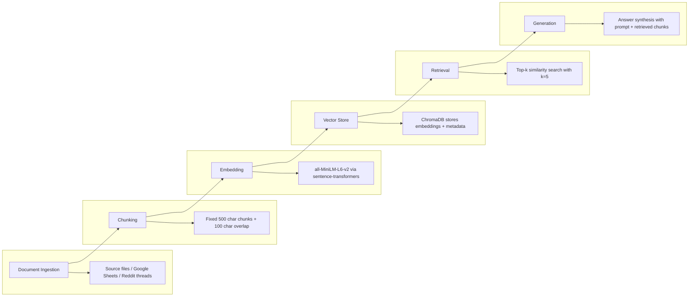

# Project 1 Planning: The Unofficial Guide

> Write this document before you write any pipeline code.
> Your spec and architecture diagram are what you'll use to direct AI tools (Claude, Copilot, etc.) to generate your implementation — the more specific they are, the more useful the generated code will be.
> Update the Retrieval Approach and Chunking Strategy sections if you change your approach during implementation.
> Update this file before starting any stretch features.

---

## Domain

"Should I take X course? Is the course good? Is it worth it?"

This sort of information is passed down via word of mouth, student to student. However, if a student is new or not well connected, they're missing out on these insights. They also might not be aware of subreddits, chat groups, and other student built online resources.
It's also very difficult when planning to know if the course you're planning to take is offered in the term you are planning to take it.
Includes supplemental course opportunities outside of the curriculum.

---

## Documents

<!-- List your specific sources: URLs, subreddit names, forum threads, or file descriptions.
     Aim for at least 10 sources that together cover different subtopics or perspectives within your domain. -->

| # | Source | Description | URL or location |
|---|--------|-------------|-----------------|
| 1 | Student built course survey | Google sheet of informal course survey results | https://docs.google.com/spreadsheets/d/1MFBGJbOXVjtThgj5b6K0rv9xdsC1M2GQ0pJVB-8YCeU/edit?gid=2042942971#gid=2042942971 |
| 2 | OSU Requirements | Lists all required courses | https://catalog.oregonstate.edu/college-departments/engineering/school-electrical-engineering-computer-science/computer-science-applied-bs-hbs/#requirementstext |
| 3 | OSU CS Course Schedule | Lists every course and when it's offered in the coming year | https://ecampus.oregonstate.edu/soc/ecatalog/ecourselist.htm?termcode=all&subject=CS |
| 4 | OSU subreddit | Thread showing a free alternative for CS290 | https://www.reddit.com/r/OSUOnlineCS/comments/1s2bsn9/everyone_should_be_taking_full_stack_open/ |
| 5 | OSU subreddit | Thread with class advice for new student | https://www.reddit.com/r/OSUOnlineCS/comments/1nscw8b/finally_accepted_winter_2026_start/ |
| 6 | OSU subreddit | Thread about CS 373 | https://www.reddit.com/r/OSUOnlineCS/comments/1lo19nj/cs_373_what_in_the_actual_f/ |
| 7 | OSU subreddit | Thread about CS 467 | https://www.reddit.com/r/OSUOnlineCS/comments/1m7cr4l/cs_467_thougts/ |
| 8 | OSU subreddit | Thread about CS 332 | https://www.reddit.com/r/OSUOnlineCS/comments/1mhx9ss/cs_332_intro_to_applied_ds/ |
| 9 | OSU subreddit | Thread about CS 499 | https://www.reddit.com/r/OSUOnlineCS/comments/1mxmr0k/cs_499_vertically_integrated_projects/ |
| 10 | OSU subreddit | Thread about what courses help you find a job | https://www.reddit.com/r/OSUOnlineCS/comments/1tlqxo9/what_classes_will_help_you_get_a_job/ |
| 11 | OSU subreddit | Thread about CS 332 and CS 432 | https://www.reddit.com/r/OSUOnlineCS/comments/1si34b9/cs332_intro_to_data_science_and_cs432_intro_to/ |
| 12 | OSU subreddit | Thread about CS 372 | https://www.reddit.com/r/OSUOnlineCS/comments/1qyz9qb/did_they_revamp_cs_372_introduction_to_computer/ |
| 13 | OSU subreddit | Thread about AI531, CS 370, CS 427, CS 464, CS 492, CS 493 | https://www.reddit.com/r/OSUOnlineCS/comments/1pdjhdf/ai531_agents_search_reasoning_cs370_into_to/ |

---

## Chunking Strategy

<!-- How will you split documents into chunks?
     State your chunk size (in tokens or characters), overlap size, and explain why those
     numbers fit the structure of your documents.
     A review-heavy corpus warrants different chunking than a long FAQ. -->

**Chunk size:**

500 characters

**Overlap:**

100 characters

**Reasoning:**

Since the sources are mostly from reddit threads or short course reviews, with a large variety of lengths, and because I am constrained to use a fixed chunk size and overlap for all documents, I'm starting with using a chunk size of 500 characters and an overlap of 100 characters for now. Sometimes the meta data for the review (like what course the review for) is not contained in the body of the review, so I want to ensure the chunking strategy has the best chance at keeping that information with the review. I can revisit this strategy if I find that the results are poor (e.g. I get incorrect retrievals because the course name is in a different chunk than the review text or because I get too much irrelevant information due to multiple unrelated review results being returned for one course).

---

## Retrieval Approach

<!-- Which embedding model are you using (e.g., all-MiniLM-L6-v2 via sentence-transformers)?
     How many chunks will you retrieve per query (top-k)?
     If you were deploying this for real users and cost wasn't a constraint, what tradeoffs
     would you weigh in choosing a different embedding model — context length, multilingual
     support, accuracy on domain-specific text, latency? -->

**Embedding model:**
all-MiniLM-L6-v2 via sentence-transformers, as this is what we have access to for this project. It runs locally with no API key, no rate limits, and is free to use. 

**Top-k:**
I'll start with 5 chunks for now and can adjust if the results imply that the agent has too much or too little information to generate useful/correct responses.

**Production tradeoff reflection:**
For real users and if cost wasn't a constraint, the tradeoffs that would impact embedding model choices would mainly be balancing result accuracy vs. latency/speed. A more powerful embedding model that is better at grabbing the most relevant information might generate better responses. However if it is meaningfully slower, the user might lose patience and leave the tool, rendering the added accuracy useless. 

Due to the content sources of this use case being relatively short and independent, I don't expect context length being a major limiting factor that would impact the model choice.

Due to the audience of this tool (students attending or considering Oregon State University CS), features like multi-lingual support would also likely not be a major factor in the model choice, since all classes are taught in English. Therefore fluency in English should be a safe assumption for our user base.

---

## Evaluation Plan

<!-- List your 5 test questions with their expected correct answers.
     Questions should be specific enough that you can judge whether the system's response
     is right or wrong. "What are good dining halls?" is too vague.
     "What do students say about wait times at [dining hall name] during lunch?" is testable. -->

| # | Question | Expected answer |
|---|----------|-----------------|
| 1 | "Can I not take CS 225?" | "No, CS 225 is a required course per the curriculum requirements. Source: [link to source]" |
| 2 | "Should I take CS 225?" | "Yes, CS 225 is a required course per the curriculum requirements. Source: [link to source]" |
| 3 | "Should I take CS 373 as one of my elective choices?" | "Student sentiment is negative based on reviews, so probably not. Source: [link to source]" |
| 4 | "As a new student, which courses should I take?" | "As a new student, you should consider taking CS 161 and CS 225. Source: [link to source]" |
| 5 | "Should I take CS 332 and CS 432 as my electives?" | "Student sentiment is mixed based on reviews, so you might want to consider your interests and career goals. Source: [link to source]" |

---

## Anticipated Challenges

<!-- What could go wrong? Name at least two specific risks with reasoning.
     Consider: noisy or inconsistent documents, missing source attribution, off-topic
     retrieval, chunks that split key information across boundaries. -->

1. Since one of the main sources is a google sheet of informal student course reviews, I'm concerned about how the structure of the data will impact chunking and retrieval, as I think since they're not necessarily semantically structured, it might negatively impact the responses. I'm pre-processing the data to remove irrelevant columns to try and mitigate these risks. 

2. I'm worried that due to the mix of formats (reddit threads vs google sheets vs tables in a webpage) that the fixed character chunking strategy might not perform well across all the data sources. It might be difficult to tune the chunk size and overlap size to generate great results from all the sources. For example, maybe one set of chunk and overlap size generates great results for the google sheet reviews, but negatively impacts the results based on subreddit threads (or vice versa).

---

## Architecture

<!-- Draw a diagram of your pipeline showing the five stages:
     Document Ingestion → Chunking → Embedding + Vector Store → Retrieval → Generation
     Label each stage with the tool or library you're using.
     You can use ASCII art, a Mermaid diagram, or embed a sketch as an image.
     You'll use this diagram as context when prompting AI tools to implement each stage. -->

---

## AI Tool Plan

<!-- For each part of the pipeline below, describe:
     - Which AI tool you plan to use (Claude, Copilot, ChatGPT, etc.)
     - What you'll give it as input (which sections of this planning.md, which requirements)
     - What you expect it to produce
     - How you'll verify the output matches your spec

     "I'll use AI to help me code" is not a plan.
     "I'll give Claude my Chunking Strategy section and ask it to implement chunk_text()
     with my specified chunk size and overlap" is a plan. -->

**Milestone 3 — Ingestion and chunking:**
- AI tool: Copilot and Claude. I'll be using Claude for the first time, so I want to experiment with it and compare my experience against Copilot, which I've used before. 
- Input: I'll provide it the documents, the document and chunking sections of the planning doc, and my architecture diagram. If it's really struggling, I might also provide it with some example chunking code from the lab.
- Expected output: A script that uploads all my documents, cleans them or ensures that they're clean, chunks them according to the defined chunking strategy.
- Verification: Per the project requirements, I'll be manually verifying at least 5 representative chunks to verify chunk quality. I'll also count the total chunks to verify the chunks meet the project requirements. I'll also verify that no empty chunks and no html are contained in chunks, that the chunks are consistently sized, and that the correct metadata is attached to each chunk.

**Milestone 4 — Embedding and retrieval:**
- AI tool: Copilot and Claude, for the same reasons as Milestone 3.
- Input: Architecture diagram, the embedding and retrieval sections of the planning doc, and requirements from the project assignment page. If it's struggling, I might also provide it with some example code from the lab.
- Expected output: All chunks loaded into ChromaDB with metadata for each chunk, a retrieval function that accepts a query string and returns the top-k most relevant chunks
- Verification: Per the project requirements, I'll be manually verifying the retrieval with at least 3 out of 5 evaluation plan queries.

**Milestone 5 — Generation and interface:**
- AI tool: Copilot and Claude, for the same reasons as Milestone 3. Additionally use Gradio web UI as suggested by the project requirements.
- Input: Per the project requirements, I'll input my grounding requirements, the output format desired, via a prompt. I'll also provide my LLM to connect to with a prompt. 
- Expected output: Code for a UI and response generation, following the format desired and obeying the guardrail requirements.
- Verification: Per the project requirements, I'll be manually verifying the grounded generation end-to-end on 2-3 queries.